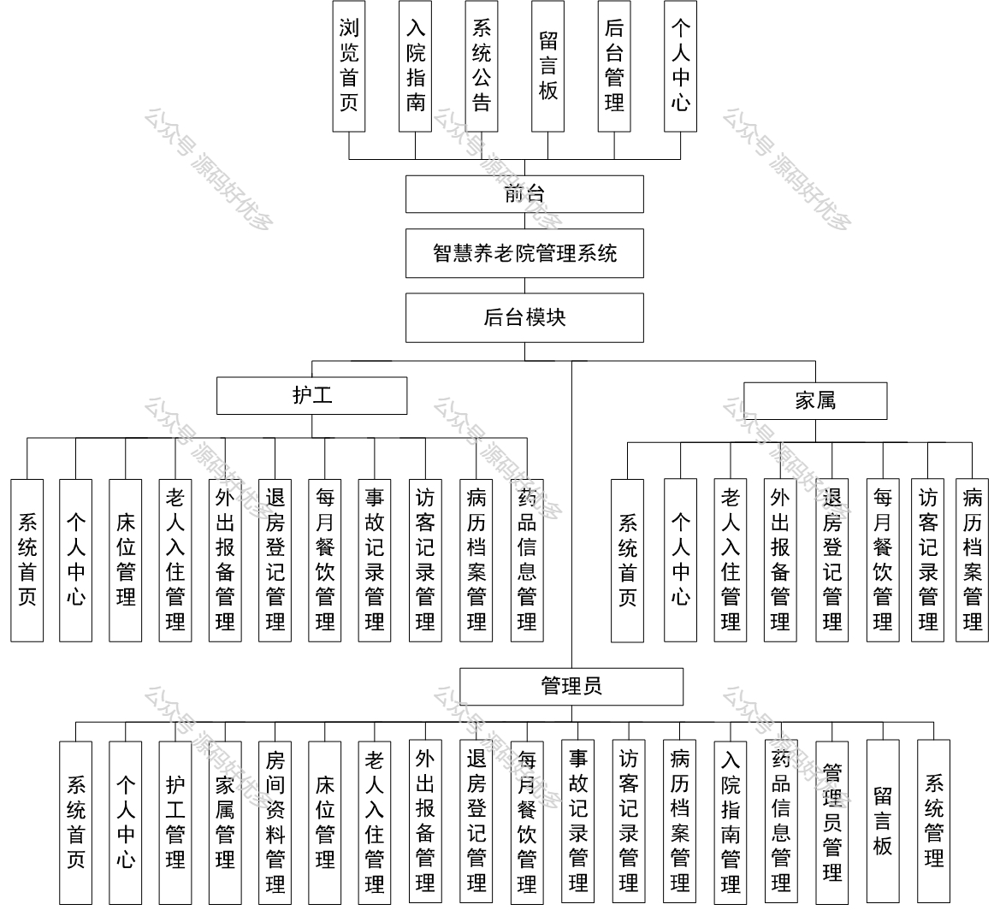
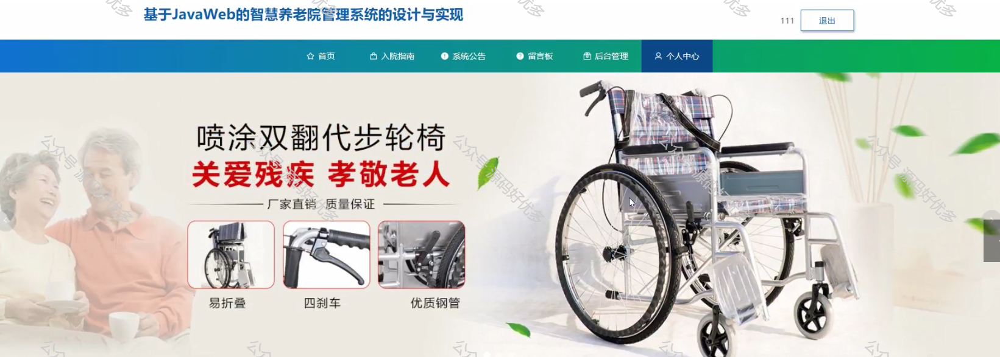
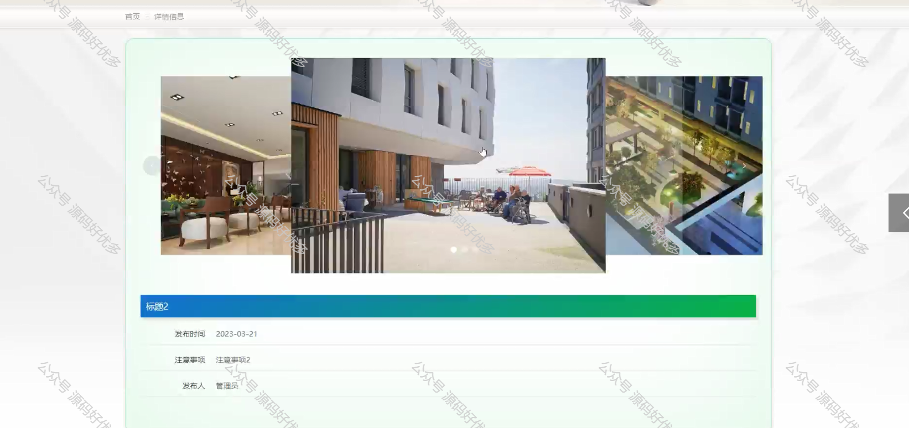
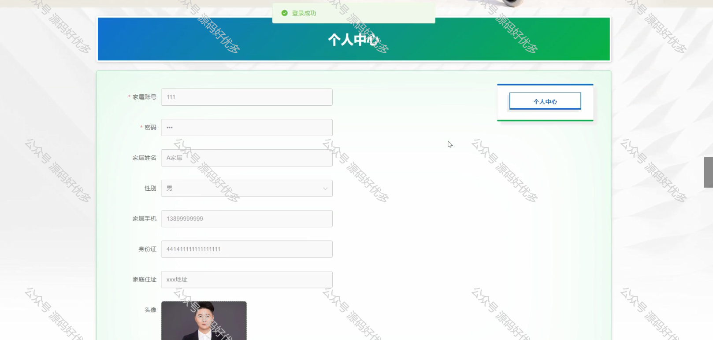
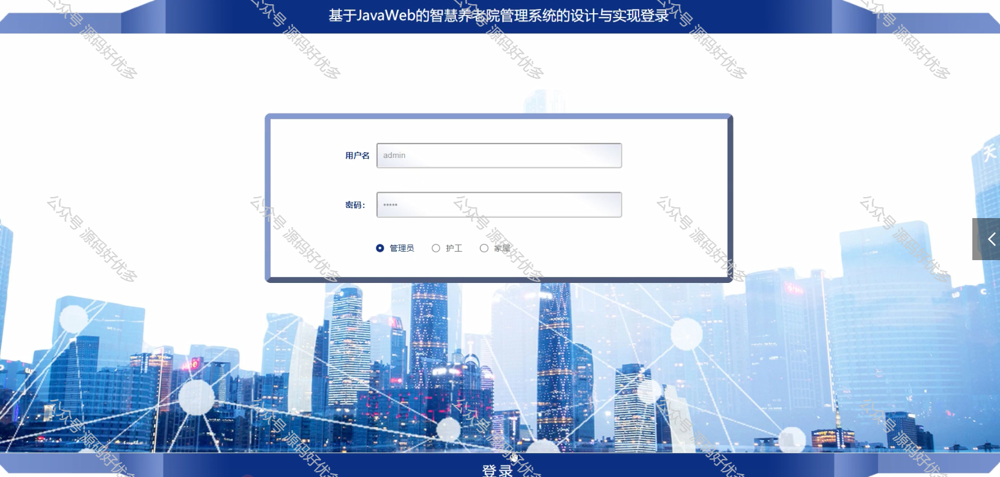
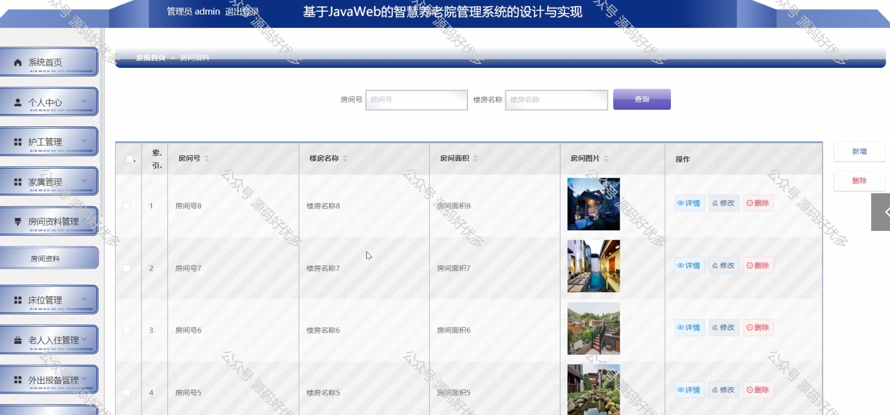
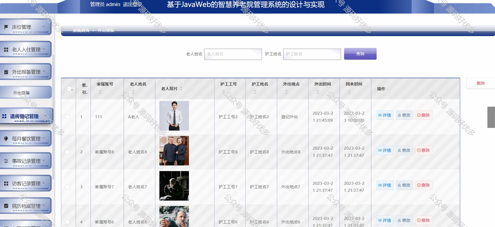
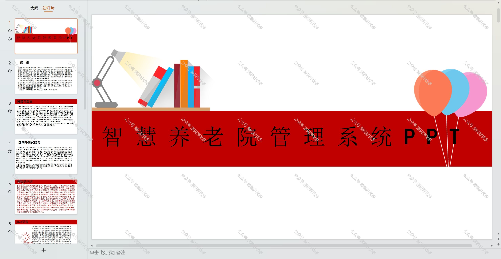
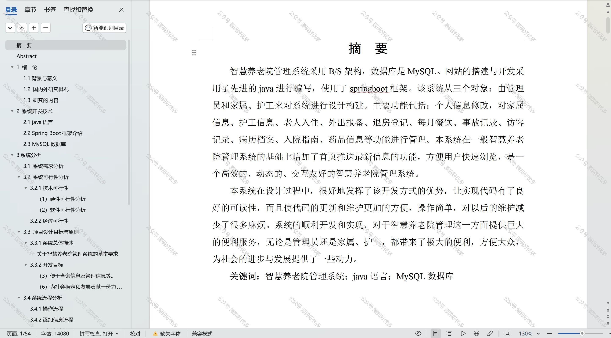

 
## 查看主页获取源码

### 一、作品包含

源码+数据库+设计文档万字+PPT+全套环境和工具资源+部署教程

### 二、项目技术

前端技术：Html、Css、Js、Vue、Element-ui

数据库：MySQL

后端技术：Java、Spring Boot、MyBatis

  

### 三、运行环境

开发工具：IDEA/eclipse

数据库：MySQL5.7

数据库管理工具：Navicat10以上版本

环境配置软件： JDK1.8+Maven3.6.3

前端Nodejs：14

### 四、项目介绍
项目编号：springbootA235

随着社会老龄化的加剧，智慧养老院管理系统应运而生，它代表着养老服务行业向智能化、精细化方向发展的重要趋势。该系统通过集成先进的信息技术，为养老院提供了一种全新的运营模式，旨在提升养老服务质量，增强老年人的生活质量，同时为养老院管理带来革命性的变革。

前台用户功能：浏览首页、入院指南、系统公告、留言板、后台管理、个人中心。

后台分为管理员、护工、家属
管理员的功能：系统首页、个人中心、护工管理、家属管理、房间资料管理、床位管理、老人入住管理、外出报备管理、退房登记管理、每月餐饮管理、事故记录管理、访客记录管理、病历档案管理、入院指南管理、药品信息管理、管理员管理、留言板以及系统管理等功能。
护工的功能：系统首页、个人中心、床位管理、老人入住管理、外出报备管理、退房登记管理、每月餐饮管理、事故记录管理、访客记录管理、病历档案管理、药品信息管理。
家属的功能：系统首页、个人中心、老人入住管理、外出报备管理、退房登记管理、每月餐饮管理、访客记录管理、病历档案管理。

### 五、运行截图

  
